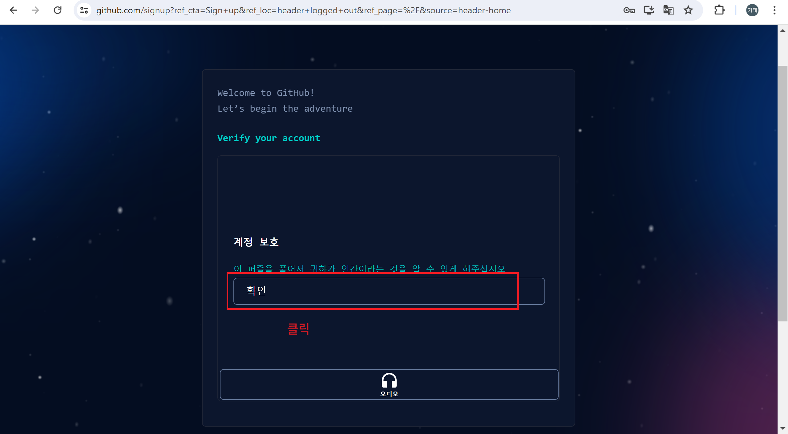
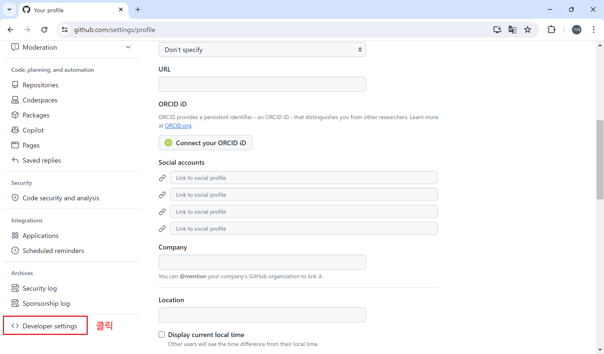

# 1. git 과 git hub 

## 1-1. git과 git hub 살펴보기

### 1-1-1. Git과 Git Hub의 개념


Git은 **버전 관리 소프트웨어**이며, 로컬 저장소(Local Repository)를 관리합니다.

Git Hub는 **클라우드 기반의 호스팅 서비스**이며, 원격 저장소(Remote Repository)를 관리한다.

<br>


<br>

그러므로, 각 작업자는 Git 이 설치된 로컬 저장소에서 작업을 완료 하고, 하나의 통합된 원격 저장소인 Git Hub 에 올리면, 버전 관리 및 팀별 작업도 가능해지게 된다.  

<br><br>

### 1-1-2. Git


- Git Bash 를 다운로드 받아 설치하게 되면, Git을 사용하여 로컬 시스템에 버전 관리를 진행할 수 있다. 

<br><br>

### 1-1-2. Git Hub


- Git Hub는 회원가입을 통해 서비스를 받을 수 있다.
- Git Hub 외에도 원격 저장소(Remote Repository)를 제공하는 클라우드 호스트 시스템이 여러 곳이 있다.

<br>

#### 1-1-2-1. Git 과 연동이 가능한 원격 저장소 제공 사이트

| Git 호스팅 사이트	| 모기업 | 특징 | 가격 정책 |
|---------------|---------------|----------------------------------------------|--------------------|
| GitHub.com | GitHub Inc <br> (Microsoft에서 인수) | 사용자 1억 명 이상. 세계 최대 규모의 Git 호스팅 사이트	| 공개 저장소 생성 무료, 비공개 저 장소는 작업자 3인 이하인 경우에 무료. 설치형 버전인 Enterprise를 월 21달러에 사용할 수 있다. |
| GitLab.com | GitLab Inc |	GitHub에 뒤지지 않는다. NASA, Sony 등 10만 개 이상의 조직에서 사용하고 있다. GitLab 프로젝트 자체가 오픈 소스여서 직접 서비스 발전에 기여할 수 있다. | 	공개 저장소 및 비공개 저장소 생성 무료. 소스 코드 빌드에 유용한 도구 지원 성능에 따라 월 19~99 달러 부담 |
| BitBucket.org | Atlassian | 사용자 1000만 명. 이슈 관리 시스템 인 지라(Jira)를 만든 Atlassian이 모기업이어서 지라와 연동이 쉽다. | 5명 이하 팀이면 공개 저장소 및 비공개 저장소 생성 무료. 그 이상이면 월 3~6달러 부담 | 

<br><br>

#### 1-1-3. Git 과 Git Hub 연동 작업과 주요 용어


**(1) init**

- 현재 디렉토리를 로컬 저장소(Local Repository)로 만드는 행위로 숨긴 디렉토리 상태로 .git이란 이름을 가진 디렉토리가 생성되고, 그 자리에 로컬 저장소의 정보가 저장된다.
- 로컬 저장소를 처음 만들거나 현재 저장소를 초기화할 때 사용한다.

<br>

<span style="color:red;font-weight:bold;font-size:18px">※ 현재 디렉토리가 아닌 상위 디렉토리나 하위 디렉토리에 .git 디렉토리가 있다면, 저장소 충돌이 발생하여 버전 관리가 되지 않으니 주의하기 바람.</span>

<br>

**(2) add**

- 현재 디렉토리의 작업 내용들을 깃에서 마련한 특정 공간(스테이지)에 내 프로젝트를 임시로 올려 놓는 작업을 말한다.

<br>

**(3) commit**

- 로컬 저장소(Local Repository)의 내용을 특정 버전으로 저장하고, 해당 버전을 가리키는 고유번호(hash: 해시 값)가 발행되며, 추후 백업이나 복구를 해야할 때 그 고유번호를 통해 복구시점으로 돌아갈 수 있다.

<br>


**(4) push**

- Git(Local Repository) 에서 Git Hub(Remote Repository) 에 업로드 하는 행위를 말한다.

<br>

**(5) pull**

- Git Hub(Remote Repository) 에 있는 프로젝트 소스를 Git(Local Repository)로 다운로드 하는 행위를 말한다.


<br>

**(6) clone**

- Git Hub(Remote Repository) 에 있는 프로젝트 소스를 다운로드 하여 저장소(Repository) 복제하는 행위를 말한다.

<br>

**(7) fetch**

- pull처럼 실제 코드를 내려 받는 것이 아니라 fetch는 그래프만 업데이트 하여 해당 저장소(Repository)를 가르키는 부분이 다른 곳으로 변경된다.

<br>

**(8) fork**

- 다른 사람의 Github repository에서 내가 어떤 부분을 수정하거나 추가 기능을 넣고 싶을 때 해당 respository를 내 Github repository로 그대로 복제하는 기능으로 clone은 복제만 되고, 원본 Repository가 변경되었을 때 변경사항을 적용하지 못하지만, fork 된 Repository는 변경된 원본 Repository 의 내용만 fetch나 rebase 명령으로 가져올 수 있다.

<br>

**(9) remote**

- 로컬 저장소(Local Repository)에 연동되는 원격 저장소(Remote Repository)를 말한다.

<br>

**(10) config**

- Git 의 사용자 환경 설정에 관련된 작업을 의미한다.

<br>

**(11) branch**

- Git/Git Hub의 여러 갈래(가지)를 branch 라고 하며, 주 가지(main/master)가 있고, 작업자 마다 다른 가지(브랜치)를 생성하여 하나의 프로젝트의 저장소(Repository)를 분할하여 사용할 수 있다. 

**(12) status**

- Git(Local Repository)의 현재 상태 정보가 담겨 있다.

<br>

**(13) checkout**

- 현재 브랜치에서 다른 브랜치로 이동하는 것을 말한다.

<br>

**(14) merge**

- 브랜치를 합치는 것을 말하며, 보통은 main 또는 master 에 통합을 한다.


<br><br><br>

## 1-2. git bash 다운로드 및 설치

### 1-2-1. [git bash 다운로드 사이트로 이동하기](https://git-scm.com/downloads)


<br><br>

### 1-2-2. git bash 설치


<br><br><br>

## 1-3. git hub 가입 및 로그인

### 1-3-1. git hub 가입





<br><br>

### 1-3-2. git hub 인증 및 로그인


<br><br>

### 1-3-3. git hub 새로운 레포시토리 생성


<br><br>

### 1-3-4. git hub 토큰 생성





<br><br><br>

## 1-4. git bash 기본 명령


<br><br><br>

### 1-4-1. git bash 리눅스 명령

- ls : 현재 있는 파일 리스트 출력
- ls -l : 현재 있는 파일 리스트 출력
(더 자세하게 / 파일명, 생성일, byte단위 용량 / 권한 1333> 맨앞 1 -:파일, d:폴더)
- ll : ls -l 옵션과 같음
- ls -al : 숨김 파일까지 모든 파일 보기
- explorer . : 해당 디렉토리의 윈도우 탐색기 띄우기
- touch [파일명] : 파일 생성
- touch [파일명][파일명] : 띄어쓰기 하면 그 만큼 파일 생성
방향키 위,아래 : 내가 입력했던 명령어들을 불러옴
- history : 내가 입력했던 명령어 리스트 보기
- rm [파일명] : 해당 파일 삭제
- rm [파일명][파일명] : 띄어쓰기로 해당 파일들 삭제
- tap키 : 파일명 자동완성
(에스터리크 / 와일드카드) : 모든 파일
ex) rm aa : aa로 시작하는 모든 파일 삭제

- mkdir [파일명] : 디렉토리 생성
- mkdir [.파일명] : 숨김 디렉토리 생성
- rmdir [파일명] : 디렉토리 삭제
- touch [.파일명] : .으로 시작하는 파일은 숨긴 파일
- clear : 화면 클리어
- cd [디렉토리명] : 디렉토리 이동
- cd .. : 상위 디렉토리로 이동


<br><br><hr><br><br>

# 2. git bash 사용법


## 2-1. 구성 (Config)

- 구성(Config)은 운영체제 단위의 Git 환경 설정이다.
- 개행 문자(Newline) 구성은 Windows와 Unix 계열 운영체제(macOS) 간의 줄바굼 호환성 문제를 방지하기 위한 설정이다.
- 이름과 이메일은 버전 생성 시 작성자 정보를 표시하기 위함으로, GitHub 등의 서비스 사용자 정보와 달라도 무방하나 되도록 같게 작성하는 것이 좋다.

| 명령 | 설명 |
|-----------------------------------------------------|------------------------------------|
| git -v | Git 버전 확인 |
| git config --global core.autocrlf input | 개행 문자 설정 (macOS) |
| git config --global core.autocrlf true | 개행 문자 설정 (Windows) |
| git config --global user.name '<이름>' | 사용자 이름 설정 |
| git config --global user.email '<이메일>' | 사용자 이메일 설정 |
| git config --global init.defaultBranch main | Git v2.28 미만인 경우, 메인 브랜치 이름을 main으로 설정 |
| git config --global pull.rebase true | pull 명령어 실행 시 리베이스를 기본 동작으로 설정 (선택) |
| git config --global --list | 구성 목록 확인 |
| git config --global --unset <항목이름> | 구성 항목 삭제 |

<br><br>

## 2-2. 초기화 (Init) 

- 초기화(Init)는 프로젝트 단위로 Git 버전 관리를 시작하는 기능이다.
- 원격 별칭(Remote Alias)은 원격 저장소를 지칭하는 이름으로, 단일 원격인 경우 origin을 사용하는 것을 추천한다.


| 명령	| 설명 | 예시 |
|--------------------------|--------------------------------|---------------------------------|
| git init | 프로젝트 버전 관리 시작 |  |	
| git remote | 원격 저장소 목록 확인 |  |	
| git remote -v | 원격 저장소 URL 확인 |  |
| git remote add <원격별칭> <URL> | 원격 저장소 추가 | git remote add origin https://github.com/kkt09072/html5.git |
| git clone <URL> | 원격 저장소 복제 | git clone https://github.com/kkt09072/html5.git |
| rm -rf .git | 버전 관리 초기화 (macOS) |   |	
| rmdir /s .git | 버전 관리 초기화 (Windows) |   |	

<br><br>

## 2-3. 추적 (Track)

- 추적(Track)은 버전을 관리할 대상(파일)을 지정하는 것을 말한다.
- 스테이징(Staging)은 추적 파일을 버전 생성을 위해 준비하는 것을 말한다.


| 명령	| 설명 | 예시 |
|--------------------------|--------------------------------|---------------------------------|
| git status | 현재 브랜치의 변경사항 확인 |   | 	
| git add <파일> | 특정 파일 추적 및 스테이징 | git add ./src/main.js | 
| git add .	| 모든 파일 추적 및 스테이징 |   | 	
| git mv <파일A> <파일B> | 스테이징된 파일 이름 변경 | git mv ./mnin.js ./main.js | 
| git rm -r --cached <파일> | 추적 목록에서 제거 (.gitignore 갱신) | git rm -r --cached ./src | 
| git clean -fdn | 삭제 가능한 추적되지 않은 파일 목록 확인 |   | 	
| git clean -fd	| 추적되지 않은 파일 삭제 |   | 	
| git restore --staged <파일> | 특정 파일 언스테이징 (v2.23) | git restore --staged ./src/main.js | 
| git restore --staged . | 모든 파일 언스테이징 (v2.23)	|   | 

<br><br>

## 2-4. 버전 생성 (Commit)

- 버전 생성(Commit)은 현재 작업 내용을 하나의 버전으로 기록(생성)하는 것을 말한다.


| 명령	| 설명 | 
|--------------------------------|---------------------------------|
| git commit -m '<메시지>' | 버전 생성 (따옴표 닫기 전에는 메시지 줄바꿈 가능) | 
| git commit -am '<메시지>' | 추적 파일 스테이징 및 버전 생성 | 
| git commit > i > 메시지 입력 > esc > :wq | Vim 에디터로 메시지 작성 및 버전 생성 | 
| git commit --amend | 직전 커밋을 현재 커밋으로 덮어쓰기, Empty Commit (이후 강력(-f) 푸시 필요) |


## 2-5. 확인 (Log)

- 확인(Log)은 생성한 버전 내용이나 내역, 변경 사항, 작업자 등을 확인하는 것을 말한다.


| 명령	| 설명 | 예시 |
|--------------------------|--------------------------------|---------------------------------|
| git log | 현재 브랜치의 버전 내역을 확인 |   | 	
| git log -<숫자> | 숫자만큼만 최신 버전 내역 확인 | git log -2 | 
| git log --all | 모든 브랜치 내역 확인  |   | 
| git log --oneline | 간략한 버전 내역 확인 |   | 	
| git log --graph | 그래프 형태로 버전 내역 확인 |   | 	
| git reflog | 로컬의 모든 버전 관리 내역 확인	|   | 
| git show | 현재 브랜치의 최신 버전 확인 |   | 	
| git show <브랜치> | 특정 브랜치의 최신 버전 확인 | git show dev | 
| git show <해시> | 특정 버전 확인 | git show 1a2b3c4d | 
| git blame <파일> | 특정 파일의 작업자 확인 | git blame ./src/main.js | 
| git blame -L <시작>,<종료> <파일> | 특정 파일의 시작부터 종료 줄까지 작업자 확인	 | git blame -L 10,20 ./src/main.js | 
| git blame -L <시작> <파일> | 특정 파일의 시작부터 마지막 줄까지 작업자 확인	 | git blame -L 10 ./src/main.js | 
| git blame -L ,<종료> <파일>  | 특정 파일의 처음부터 종료 줄까지 작업자 확인 | git blame -L ,20 ./src/main.js | 

<br><br>

## 2-6. 브랜치 (Branch)

- 브랜치(Branch)는 프로젝트에서 여러 작업을 나눠 병렬로 진행할 수 있는, 버전 관리의 각 분기점을 의미한다.

| 명령	| 설명 | 예시 |
|--------------------------|--------------------------------|---------------------------------|
| git branch | 로컬 브랜치 목록 확인 |   | 	
| git branch -r | 원격 브랜치 목록 확인	|   | 
| git branch -a | 로컬 및 원격 브랜치 목록 확인 |   | 	
| git branch <브랜치> | 브랜치 생성 | git branch dev | 
| git branch -D <브랜치> | 브랜치 삭제 | git branch -D dev | 
| git branch -m master main	| 브랜치 이름 변경 |  |  	
| git checkout <브랜치> | 브랜치 전환 | git checkout dev | 
| git checkout -b <브랜치> | 브랜치 생성 및 전환 | git checkout -b dev | 
| git checkout <해시> | 특정 버전 체크아웃 | git checkout 1a2b3c4d | 
| git switch <브랜치> | 브랜치 전환 (v2.23) | git switch dev | 
| git swtich -c <브랜치> | 브랜치 생성 및 전환 (v2.23)	git | switch -c dev | 

<br><br>

## 2-7. 밀어내기 (Push)

- 밀어내기(Push)는 로컬 저장소의 버전 내역을 원격 저장소로 업로드하는 기능이다.
- 강제 플래그(--force, -f)는 충돌을 무시하고 원격 저장소를 덮어쓰므로, 확실한 경우에만 사용해야 한다.


| 명령	| 설명 | 예시 |
|--------------------------|--------------------------------|---------------------------------|
| git push <원격별칭> <브랜치> | 원격 저장소로 밀어내기	git push origin dev | 
| git push <원격별칭> --all | 원격 저장소로 모든 브랜치 밀어내기	| git push origin --all | 
| git push <원격별칭> <브랜치> -f | 원격 저장소로 강제(Force) 밀어내기	git push origin dev -f | 
| git push <원격별칭> <브랜치> -u | 원격 저장소로 밀어내기 후 생략 가능	 | git push origin dev -u 이후 git push | 

<br><br>

## 2-8. 당겨오기 (Pull)

- 당겨오기(Pull)는 원격 저장소의 버전 내역을 로컬 저장소로 다운로드하는 기능이다.

| 명령	| 설명 | 예시 |
|--------------------------|--------------------------------|---------------------------------|
| git pull <원격별칭> <브랜치> | 원격 저장소에서 브랜치 당겨오기 | git pull origin dev | 
| git pull <원격별칭> --all	| 원격 저장소에서 모든 브랜치 당겨오기	 | git pull origin --all | 
| git pull --rebase <원격별칭> <브랜치>	| 원격 저장소의 브랜치로 로컬 브랜치 덮어쓰기	 | git pull --rebase origin dev | 

<br><br>

## 2-9. 가져오기 (Fetch)

- 가져오기(Fetch)는 원격 저장소의 최신 내역을 로컬의 원격 내역과 동기화하는 기능으로, 로컬 브랜치에는 영향을 주지 않는다.

| 명령	| 설명 | 예시 |
|--------------------------|--------------------------------|---------------------------------|
| git fetch | 현재 원격 저장소의 브랜치 목록 가져오기 |   | 	
| git fetch <원격별칭> | 특정 원격 저장소의 브랜치 목록 가져오기 | git fetch origin | 
| git fetch -all | 모든 원격 저장소의 브랜치 목록 가져오기 |   | 	
| git fetch --prune	| 원격 저장소에서 브랜치 목록 가져와서 로컬의 원격 브랜치 목록 덮어쓰기 |   | 	

<br><br>

## 2-10. 비교 (Diff)

- 비교(Diff)는 두 개의 버전이나 파일 등의 차이를 서로 비교하는 기능이다.

| 명령	| 설명 | 예시 |
|--------------------------|--------------------------------|---------------------------------|
| git diff <파일> | 파일의 수정 내용 확인 |   | 
| git diff <파일A> <파일B> | A와 B 파일 비교 |   | 	
| git diff <브랜치> | 특정 브랜치와 현재 브랜치 비교 | git diff dev | 
| git diff <브랜치A> <브랜치B> | A와 B 브랜치 비교 | git diff main dev | 
| git diff <브랜치A>:<파일> <브랜치B>:<파일> | A와 B 브랜치의 파일 비교 | git diff main:src/main.js dev:src/main.js | 
| git diff <해시> | 현재 버전과 특정 버전 비교 | git diff 1a2b3c4d |  |
| git diff <해시A> <해시B>	| A와 B 버전 비교 | git diff 1a2b3c4d 5e6f7g8h | 

<br><br>

## 2-11. 작업 취소 (Rollback)

- 롤백(Rollback)은 현재 작업 중인 변경 사항을 모두 취소하고 버리는 것을 말한다.

| 명령	| 설명 | 예시 |
|--------------------------|--------------------------------|---------------------------------|
| git checkout HEAD -- <파일> | 특정 파일 롤백 | git checkout HEAD -- ./src/main.js |
| git restore <파일>  | 특정 파일 롤백 (v2.23) | git restore ./src/main.js | 
| git restore .	| 모든 파일 롤백 (v2.23)	|   | 
| git reset --hard HEAD	| 모든 파일 롤백 |   | 

<br><br>

## 2-12. 초기화 (Reset)

- 초기화(Reset)는 특정 버전으로 이동하고 그 이후 버전 내역을 제거하는 기능이다.

| 명령	| 설명 | 예시 |
|--------------------------|--------------------------------|---------------------------------|
| git reset --hard HEAD~<번호> | 번호만큼 이전 버전으로 리셋 | git reset --hard HEAD~2 | 
| git reset --hard HEAD~1 | 직전 버전으로 리셋 (1 버전 전으로) |   | 	
| git reset --hard HEAD~ | 직전 버전으로 리셋 (1 생략) |   | 	
| git reset --hard <해시> | 특정 버전으로 리셋 | git reset --hard 1a2b3c4d |
| git reset --hard HEAD^ | 마지막 버전을 삭제 |   | 	
| git reset --hard | 수정 내용을 버림 |   | 
| git reset --soft | 수정 내용을 스테이징 |   | 
| git reset --mixed	수정 | 내용을 스테이징하지 않음	|   | 


<br><br>

## 2-13. 되돌리기 (Revert)

- 되돌리기(Revert)는 특정 버전을 취소하고 취소한 새로운 버전을 생성하는 기능이다.

| 명령	| 설명 | 예시 |
|--------------------------|--------------------------------|---------------------------------|
| git revert <해시> | 특정 버전을 취소하고 새로운 버전 생성	| git revert 1a2b3c4d |

<br><br>


## 2-14. 임시 저장 (Stash)

- 임시 저장(Stash)는 작업 중인 변경사항을 버전으로 생성하지 않고 별도로 저장하는 기능이다.

| 명령	| 설명 | 예시 |
|----------------------------|--------------------------------|---------------------------------|
| git stash list | 임시 저장된 작업 목록 확인 |   | 	
| git stash | 현재 작업을 임시 저장 |   | 
| git stash -a | 미추적 파일 포함, 임시 저장 |   | 	
| git stash -m '<메시지>' | 메시지와 함께 현재 작업을 임시 저장 |   | 
| git stash -am '<메시지>' | 미추적 파일 포함, 메시지와 함께 현재 작업을 임시 저장 |   | 	
| git stash show <번호>	| 특정 번호의 임시 저장 내용 보기 | git stash show 2 | 
| git stash apply | 가장 최신의 임시 저장 내용을 현재 브랜치에 적용	 |   | 
| git stash apply <번호> | 특정 번호의 임시 저장 내용을 현재 브랜치에 적용 | git stash apply 2 | 
| git stash drop | 가장 최신의 임시 저장 내용 삭제 |   | 	
| git stash drop <번호>	| 특정 번호의 임시 저장 내용 삭제 | git stash drop 2 | 
| git stash pop | 가장 최신의 임시 저장을 적용하고 목록에서 삭제 |   | 
| git stash clean | 모든 임시 저장 목록 삭제 | 	 | 

<br><br>

## 2-15. 병합 (Merge)

- 병합(Merge)은 두 개의 브랜치를 하나로 합치는 기능이다.

| 명령	| 설명 | 예시 |
|--------------------------|--------------------------------|---------------------------------|
| git merge <브랜치> | 현재 브랜치에 특정 브랜치 병합 | git merge dev |
| git merge --abort | - 충돌 시, 병합 과정 중단 |  |

- 병합을 통해 두 브랜치의 내용이 달라 충돌(Conflict)이 발생하는 경우, 충돌을 해결하고 다시 커밋해야 한다. 
- '현재 변경 사항'은 현재 브랜치(main)의 작업 내용, '수신 변경 사항'은 병합할 브랜치(dev)의 작업 내용을 의미한다. 
- 충돌 해결 후 수정된 파일을 스태이징(git add)하고 병합 버전을 생성(git commit)해야 한다. 

```
<<<<<< HEAD (현재 변경 사항)
main / abc
=======
dev / xyz
>>>>>> dev (수신 변경 사항)
```

<br><br>

## 2-16. 재배치 (Rebase)

- 재배치(Rebase)는 현재 브랜치의 내역을 대상 브랜치의 최신 버전 다음으로 배치(이동)하는 기능이다.

```
(main)-- A - B - C
          \
(dev)----- D - E
```

>재배치 전 (Before)

```
(main)-- A - B - C - D - E
```

>재배치 후 (After)

<br><br>

| 명령	| 설명 | 예시 |
|--------------------------|--------------------------------|---------------------------------|
| git rebase <브랜치> | 현재 브랜치를 대상 브랜치로 재배치 | git rebase main |
| git rebase --continue	| 재배치 계속 진행 |  |	
| git rebase --abort | 재배치 과정 중단	|  |

<br><br>

다음은 dev 브랜치를 main 브랜치로 재배치하는 과정이다.

1. git checkout dev: 재배치할 브랜치로 전환.
2. git rebase main: 현재 브랜치(dev)를 대상 브랜치(main)로 재배치 시작.
3. 충돌(Conflict) 발생 시 해결.
4. git add .: 충돌 해결 후 스테이징.
5. git rebase --continue: 재배치 계속 진행.
6. 버전 메시지 수정 및 저장(:wq).
7. 3~6번 과정 반복 및 재배치 완료!

<br><br><hr><br><br>
 


